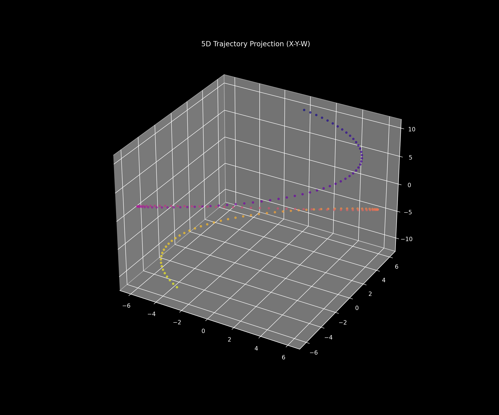
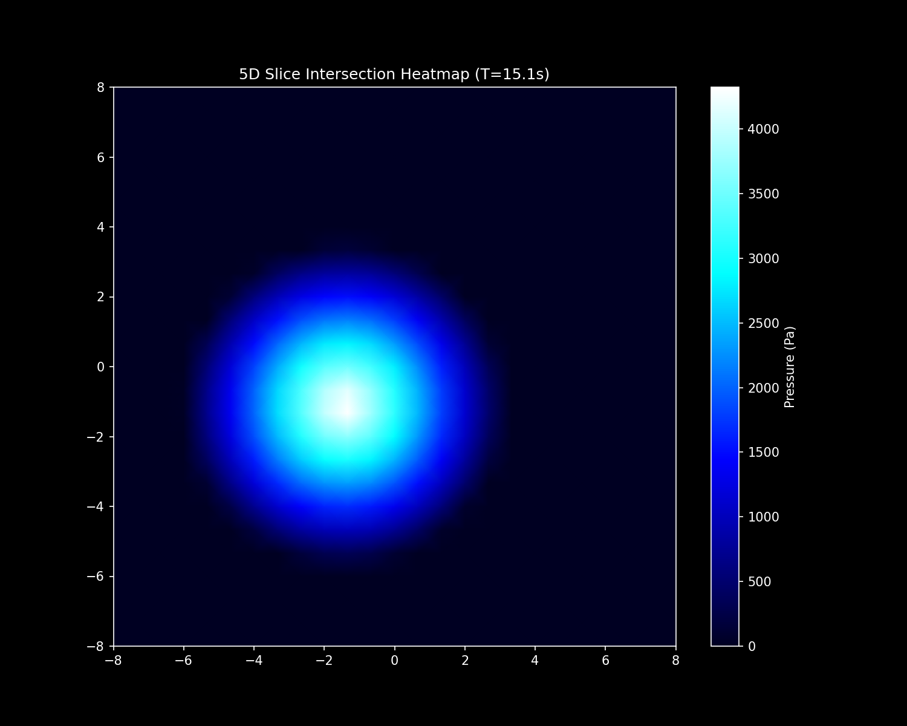
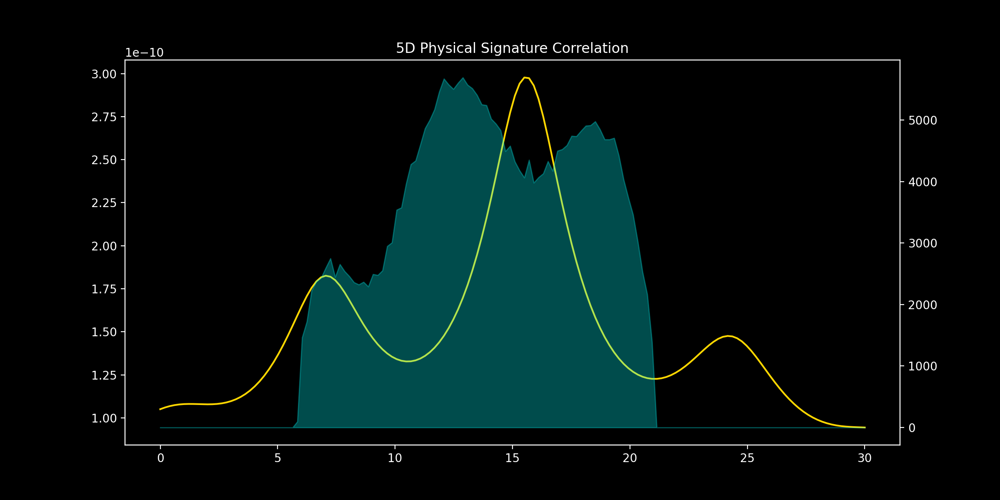

## Analysis of 5-Dimensional Topological Manifold Interaction

This study documents the interaction between a 5-dimensional hypersphere and a 3-dimensional Euclidean space. By utilizing an SO(5) rotation model and a dual-axis dimensional dive (W and V axes), we have quantified the observable physical perturbations within a laboratory sensor grid.

## Setup and Execution

### Installation
1. Clone the repository:
   ```bash
   git clone https://github.com/rahumanrahuu/manifold-intersection.git
   cd manifold-intersection
   ```
2. Install dependencies:
   ```bash
   pip install -r requirements.txt
   ```

### Running the Simulation
Execute the main simulation engine to generate data and visual reports:
```bash
python 5d_simulation.py
```
Outputs will be generated in `results/` (visuals) and `output_json/` (data).

## Experimental Configuration

The simulation environment is defined by the following parameters:
- **Mass of Manifold**: 2.0e12 kg (Approx. 2 billion metric tons)
- **Hyper-radius (RADIUS_5D)**: 6.0 meters
- **Dimensional Trajectory**: A Lissajous-style path oscillating in 3D while simultaneously diving through the W-axis ($w_{start}=10, w_{end}=-11$) and oscillating in the V-axis.
- **Rotation Model**: Lie Algebra $so(5)$ transition.

## Visual Data Analysis


*Figure 1: Projection of the 5D trajectory into our 3D frame (X, Y, W). The "dive" represents the entity's movement from the 5th dimensional bulk towards and through our 3D slice.*


*Figure 2: Spatial distribution of volumetric displacement at peak intersection (T=15.1s). The heatmap demonstrates the "leakage" of 5D volume as a function of 3D sensor proximity ($r_{3D}$).*


*Figure 3: Multi-physics correlation tracking the onset of gravitational lensing deflection versus the physical pressure spike as the manifold's hull enters 3D space.*

---

## Quantitative Findings

The following table summarizes the peak observational data retrieved from the sensor array:

| Metric | Quantitative Measurement | Analytical Significance |
| :--- | :--- | :--- |
| **Peak Static Pressure** | 5,690.6 Pa | Indicates the maximum density of air displacement at intersection. |
| **Max Gravitational Deflection** | ~10⁻¹⁰ arcseconds | The curvature signature preceding physical materialization. |
| **Intersection Radius** | Up to 6.0m | The footprint of the 4-sphere cross-section in our 3-space. |
| **Rotation Velocity** | Variable (SO(5)) | Rotation in 10 orthogonal planes (XY, XZ, XW, XV, YZ, YW, YV, ZW, ZV, WV). |

---

## What we find here

The interaction with a 5D manifold is not just a mathematical event; it is a physical disruption that would profoundly affect a 3D environment. Here is how an encounter would theoretically unfold.

### 1. Gravitation
Before the manifold is visible, its presence would be felt. Because the entity possesses a mass of approximately 2 billion metric tons, its gravity reaches into our 3D space from the "bulk."
- Imagine you are standing in a room and suddenly feel an overwhelming weight pulling you toward the center of the floor. It’s not just your local gravity increasing; it's a point-source pull toward the entity's hyper-coordinates.
- You would see small objects like pens or dust roll across the floor toward an empty point in space. The air might feel thick and hard to breathe as the gravity compresses the atmosphere around the invisible intruder.

### 2. Materialization
As the entity moves closer to our 3D slice (decreasing its $|w|$ and $|v|$ coordinates), light begins to bend. 
- You would see a "heat haze" or a shimmering Einstein ring in mid-air. This is gravitational lensing; the entity's mass is warping the light from the back of the room before the entity itself is visible.
- The entity doesn't enter through a door. It materializes from the "inside out," starting as a microscopic point that rapidly inflates into a solid 3D shape as it "dives" into our dimension.

### 3. Intersection
If the 5D entity were to move through a solid 3D object, like a chair, it would result in a topological paradox.
- The chair wouldn't be smashed; it would appear to be "swallowed" or sliced by a perfectly smooth, shimmering surface. To the 5D being, the chair is like a 2D drawing on a piece of paper—it can simply "step over" the 3D matter through the extra dimensions.
- Because the 5D being sees the 3D chair from "above" in higher space, it can see the exterior and interior simultaneously. It could reach in and remove a screw from the center of a chair leg without ever touching the wood on the outside.

### 4. Rotation
As the entity rotates in its native 5D planes, its footprint in our world would constantly change.
- It might look like a single sphere that suddenly splits into two separate objects, or a ball that instantly turns into a ring as it rotates its 5D hull through our slice.
- The high-speed rotation in 5D causes light to blue-shift. You would see the edges of the entity glow with a vibrant violet or "hard-light" color as local photons are energized by its movement and mass.

### 5. Departure
As the entity retreats back into the 5D bulk, the object would shrink back into a point and vanish. While the physical presence is gone, the gravitational "echo" would linger for a few moments, and the structural stresses left behind by the 2 billion ton mass would be a permanent record of the intersection.

---

## References

1. **Coxeter, H. S. M.** (1973). *Regular Polytopes*. Dover Publications.
2. **Kaluza, T.** (1921). "Zum Unitätsproblem der Physik". *Sitzungsberichte der Preussischen Akademie der Wissenschaften*.
3. **Klein, O.** (1926). "Quantentheorie und fünfdimensionale Relativitätstheorie". *Zeitschrift für Physik*.
4. **Banchoff, T. F.** (1990). *Beyond the Third Dimension*. Scientific American Library.
5. **Zhang, S. C.** (1997). "A Unified Theory Based on SO(5) Symmetry of Superconductivity and Antiferromagnetism". *Science*.
6. **Hollasch, S. R.** (1991). *Four-Dimensional Higher-Order Computer Graphics*. Arizona State University.

---

MIT License - see the [LICENSE](LICENSE) file for details.
